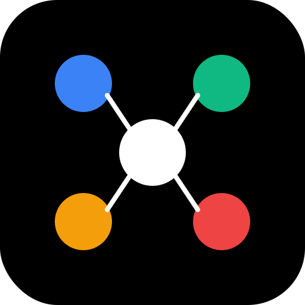

<p align="center">
  
</p>

<h1 align="center">Loom</h1>

<p align="center">
  A minimalist, browser-based system architecture diagram tool
</p>

<p align="center">
  <a href="https://suryanox.github.io/loom/">Live Demo</a>
</p>

---

## Getting Started

```bash
npm install
npm run dev
```

Open [http://localhost:5173/loom](http://localhost:5173/loom) in your browser.

---

## Commands

| Command | Description |
|---|---|
| `npm run dev` | Start the development server |
| `npm run build` | Type-check and build for production |
| `npm run preview` | Preview the production build locally |
| `npm run lint` | Run ESLint across the project |
| `npm run format` | Format all files with Prettier |

---

## What's Supported

Drag any node from the left toolbox onto the canvas and connect them with edges.

### People & Actors
| Node | Description |
|---|---|
| User | End user or human actor |
| Agent | Support or human agent |
| Supplier | External supplier or vendor |
| AI Agent | Autonomous AI agent |

### Frontend & Clients
| Node | Description |
|---|---|
| Frontend | Web frontend (SPA, SSR, etc.) |
| Mobile App | iOS / Android mobile client |

### Backend & Services
| Node | Description |
|---|---|
| Service | Generic backend microservice |
| Gateway | API gateway or reverse proxy |
| Load Balancer | Traffic distribution layer |
| CDN | Content delivery network |
| CI/CD | Continuous integration / deployment pipeline |
| Cloud | Cloud provider or cloud region |
| AI | AI model or inference service |

### Data & Storage
| Node | Description |
|---|---|
| Database | Relational database (SQL) |
| NoSQL | Non-relational / document store |
| VectorDB | Vector database for embeddings |
| Cache | In-memory cache (e.g. Redis) |
| Blob Storage | Object / file storage |
| Message Queue | Async message broker / queue |
| File | File system or file store |

### Security
| Node | Description |
|---|---|
| Auth Provider | OAuth / SSO / identity provider |
| Secrets Manager | Vault or secrets management |

### Observability
| Node | Description |
|---|---|
| Logging | Log aggregation service |
| Monitoring | Metrics and alerting |
| OpenTelemetry | Distributed tracing / telemetry |

### Integrations
| Node | Description |
|---|---|
| Notification | Push / in-app notification service |
| Webhook | Outbound HTTP webhook |
| Payment Gateway | Payment processing integration |
| Email | Email delivery service |
| SMS | SMS messaging service |
| Slack | Slack integration |
| Teams | Microsoft Teams integration |
| WhatsApp | WhatsApp messaging |
| Telegram | Telegram bot / channel |
| Line | Line messaging |
| KakaoTalk | KakaoTalk messaging |
| Telephone | Voice / telephony service |

### Extras
| Node | Description |
|---|---|
| Notes | Free-text sticky note on the canvas |

### Edges

Connect any two nodes by dragging from one handle to another. Three edge styles are available:

- **Default** — solid line
- **Dashed** — dashed line
- **Animated** — animated flowing line

Arrow direction can be set to: none, single head, or both ends.

---

## Persistence

Diagrams are **automatically saved to `localStorage`** as you work — no save button needed.

- Every change (node add, move, delete, edge update) is persisted instantly under the key `loom-diagram`.
- Your diagram is restored automatically when you reopen the app in the same browser.
- Clearing browser storage or opening in a different browser starts a fresh canvas.

> Persistence is local and browser-scoped. There is no backend or cloud sync.

---

## Tech Stack

- [React 18](https://react.dev/)
- [React Flow (@xyflow/react)](https://reactflow.dev/)
- [Vite](https://vitejs.dev/)
- [TypeScript](https://www.typescriptlang.org/)
